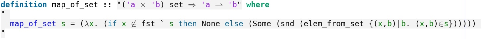

# Short Overview of the IMP- Completeness Project #
**Anran Wang**
## Introduction ##
This is a short explanation of the "IMP- to Turing Machine" project. It is meant for people who continue with the project and wish to quickly have an overview.
It first gives a shallow introduction of the project, then goes into the part that I modified and explain why the modification was sensible and necessary. 
Due to the liminations of the author, the document might have misconceptions, so take it with a grain of salt. 

## IMP- to SAS+ ##
To encode IMP- to a Turing Machine(TM), we start by encoding it to IMP-- and prove its correctness and soundness. IMP- is a "shrunk" version of IMP that does not have boolean expressions, as can be seen in their respective *com* definitions:

IMP- is furthur shrunk to IMP-- by removing arithmetic expressions and restricting its datatype to *bit = Zero | One* in IMP_Minus_Minus_Com.thy.

The reduction and the proof is in folder IMP-_To_IMP--/ .

Next step is to reduce IMP-- to TM, by reducing IMP-- to SAS+ then to TM, with intermediate steps, of course.

SAS+ is a formalism often used in AI planning. Roughly speaking, an SAS+ *problem* is defined in Isabelle as a *record* with variables, operators, initial state, goal state, and variable ranges.
An operator, if its *preconditions* are fulfilled in the current state, takes the system to the next state via its *effects*.

A list of operators solves the SAS+ problem by taking the system fron the initial state to the goal state in the obvious way (sequantially). It is then called a *solution* to the problem.

SAS++ is an "expanded" version of SAS+ by allowing uninitialised variables in the initial state.
This is reflected by the definition for *is_serial_solution_for_problem_sas_plus_plus* in SAS_Plus_Plus.thy:

The initial state *I* is expanded by finding *I'* and *I'* is treated as the usual initial state in SAS+. Here, if a variable is assigned in *I*, then it has the same value in *I'*; if it is not assigned in *I* then it is assigned in *I'* by some value.
In the counterpart definition in SAS_Plus_Representation.thy, we have something in the line of *map_of (precondition_of op) ⊆⇩m I* where the initial state should define all variables, considering operator *op* could require any variable in its precondition.

IMP-- is first reduced to SAS++, then SAS++ is reduced to SAS+, see the corresponding folders in this project. SAS+ is reduced(equivalent) to STRIPS, as shown in the afp project *Verified_SAT_Based_AI_Planning*. STRIPS in turn is to be reduced to/proven equivalent to TM.

## IMP-- to SAS++', SAS+', and STRIPS' ##

In the reduction from IMP-- to SAS++, an IMP-- program is translated to a SAS++ problem, as shown in the definition of *imp_minus_minus_to_sas_plus* in IMP--_To_SAS++/: 

We can see that we have to provide the initial and final states of the program. In this way, the program and how it will run is already fixed via its structure and its initial state. 
We would like to get rid of the states, so the structure of the program is translated to the SAS++ problem, but it could terminate or not, depending on the initial and final states that we can pass to the program. To achieve this, we get rid of the finiteness in SAS++, hence the version SAS++'. 

In the definition of *sas_plus_problem* in $AFP/Verified_SAT_Based_AI_Planning/, we see that variables, (allowed) operators, and the ranges of the variables are defined with lists, which in itself is finite. 

Since we would like to allow unknown initial states (mapping from variable to value) in the IMP-- program, it would make sense to drop the finiteness of the range of the variables. As a result, we would also have to allow potentially infinite number of allowed operators, since an operator is defined with (variable,value) tupels, and if we have infinite possible values for a variable, we would allow possibly infinite operators, as shown in IMP--To_SAS++_Prime/SAS_Plus_Prime_Representation.thy :
 

The reduction is the same as that of the finite version, with adjustments from list to set at various positions. In the final lemma, we indeed do not need to pass the initial and final states to be translated alongside the IMP-- program, so the translation itself only captures the structure of the program, see the last two lemmas in IMP--_To_SAS++_Prime/IMP_Minus_Minus_To_SAS_Plus_Plus_Prime_Correctness.thy.

The next step is to reduce this version to the corresponding SAS+' version, where the initial states are fully initialised. This is done by adding an initialisation state in the beginning, and "guessing" valid values starting from a (not fully initialised) SAS++' state so that it is a valid SAS+' state. The other steps are essentially the same as the reduction from SAS++ to SAS+ with adjusting types from list to set. 

An interesting step in the process is to define the map_of function for sets in SAS++_Prime_To_STRIPS_Prime/STRIPS_Prime_Representation.thy : 
 

It uses a simple definition of *elem_from_set* : 
 

As a result, map_of_set has similar properties like map_of that we used in the reduction, as well as other properties that worked well with the proof, for example *map_of_set_unique* in SAS++_Prime_To_STRIPS_Prime/SAS_Plus_Prime_STRIPS_Prime.thy . 

As a summary, a theorem is stated in IMP--_To_STRIPS_Prime/IMP_Minus_Minus_To_STRIPS_Prime.thy that if an IMP-- program *c* terminates in *t* steps, it can be reduced to a STRIPS' problem and it can be solved by a plan whose length is restricted by a value related to *t* and the number of variables in *c*. 

